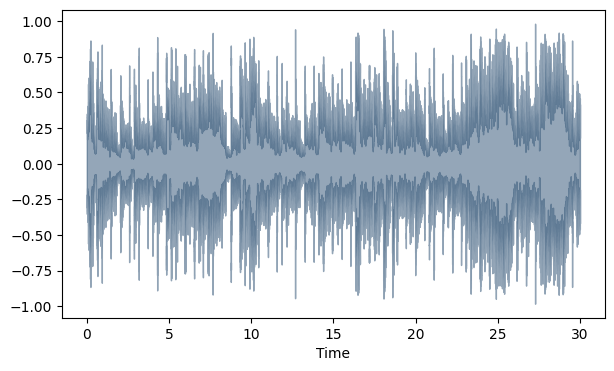
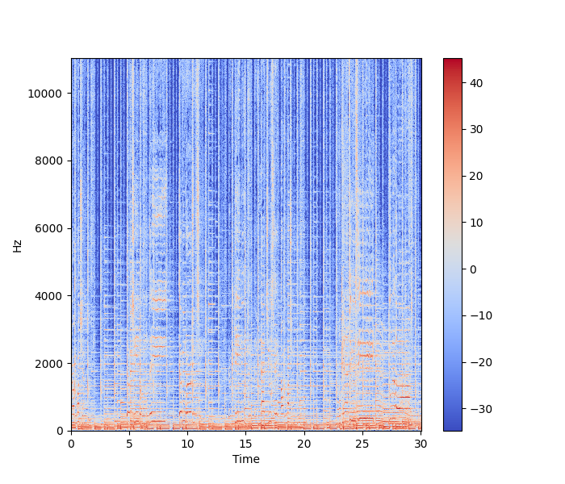
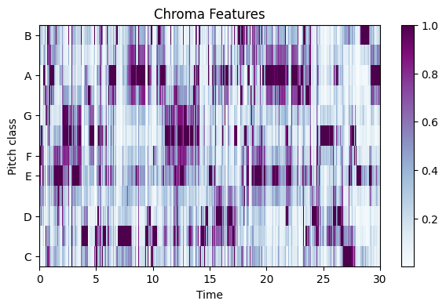

# Music-Genre-Classification
music genre classification using KNN and Neural Network techniques  
  
Check out the .ipynb file to see the working idea.

# Dataset
The dataset used is [GZTAN](https://www.kaggle.com/datasets/andradaolteanu/gtzan-dataset-music-genre-classification) (the famous GTZAN dataset, the MNIST of sounds)  
I have not included it here due to its large size.  

# Data Visualisation
Using Librosa and Seaborn libraries  

<h3>Waveshow</h3>  
  

<h3>Spectrogram</h3>  

  

<h3>Spectral rolloff</h3>  

  

<h3>Chroma</h3>   

